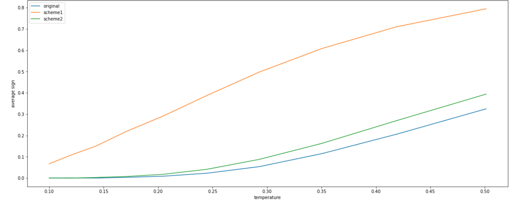
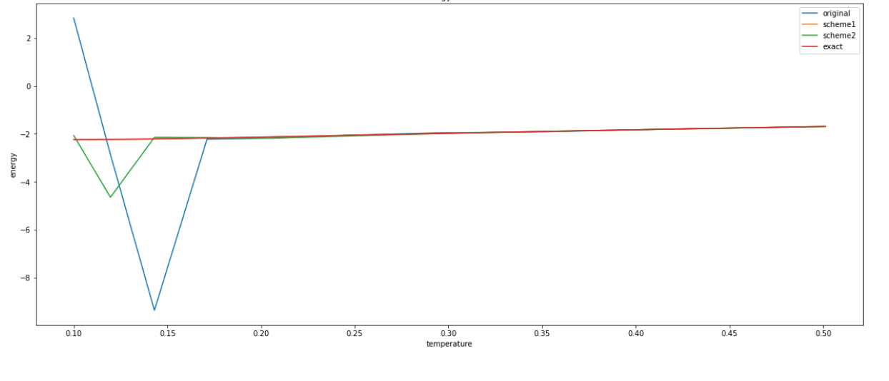
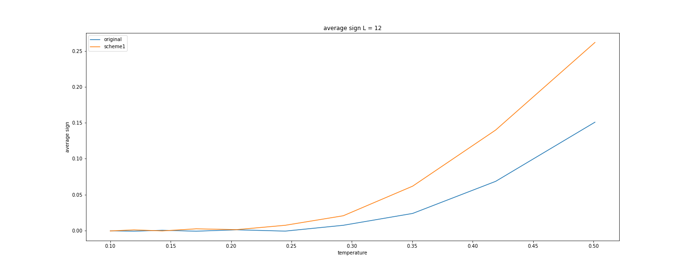
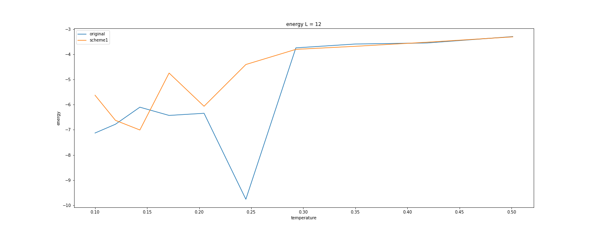
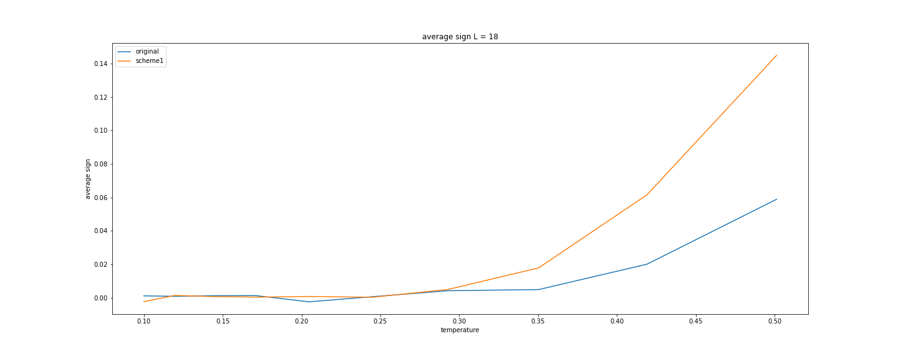
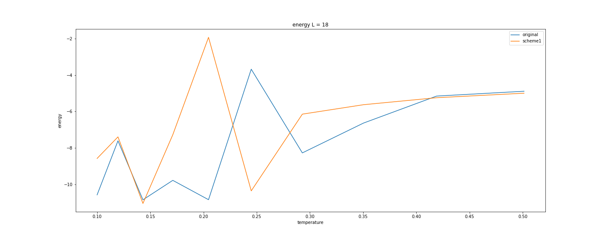

### 方法
- ３サイトを一つのサイトとみなしてボンドオペレータ$\hat{h}$(8 x 8行列)を作成
$$
\hat{H} = \sum_{l = 0}^{L/3} \hat{h}_l
$$
- $8 \times 8$ のユニタリ行列を全てのサイトに作用させる
$$
\hat{H^\prime} = \sum_{l = 0}^{L/3} u\hat{h}_lu^T
$$

- 非対角成分を負にし、$|\hat{H^\prime}|_-$の基底エネルギーを最大化する

### ユニタリ行列の選び方

#### #Scheme 1.
上の条件のもと ($2^L \times 2^L$)　$|\hat{H^\prime}|_-$ の基底エネルギーを最大化する

#### Scheme 2.
上の条件のもと（8 x 8 行列)　$|u\hat{h}_lu^T|_-$の基底エネルギーを最大化する

## L = 6

### average sign vs T

### energy vs T

## L = 12
- #### $2^12$　行列の最適化を行う事が出来ないため、 scheme 2.のみ使用
### average sign vs T

### energy vs T

## L = 18
### average sign vs T

### energy vs T
