# Shastry-Sutherland 

### exact diagonalization for L = [2,2]
- spectrum is saved in `data/shastry_exact.npy`
- At T = 1, $\langle\hat{H}\rangle=-5.58551...$

### Phase diagram

- Dimer singlet ($J/JD = J_1/J_2< 0.68$) (it is know that ground state is exactly the state covered with dimer dingelt)
- Plaquette singlet ($0.68 < J_1/J_2 < 0.76$)
- AF Neel ($J_1/J_2 > 0.76$)

It is assumed that in singlet-triplet basis, almost all configuration is $[0,0,...,0]$

## results

Here, we set $J_2$ = 1
### At fixed J1 

#### Compare with exact diagonalization

- J1 = 1, T = [0.1, ..., 10.0]

result of v1 model

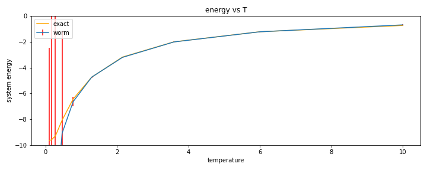

result of v2 model

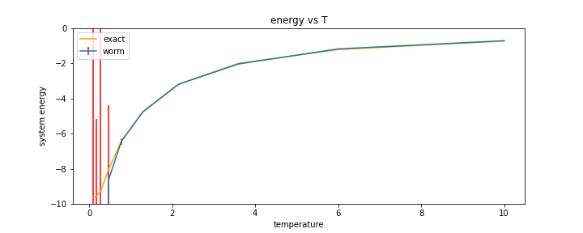

Comparing average sign between v1 and v2
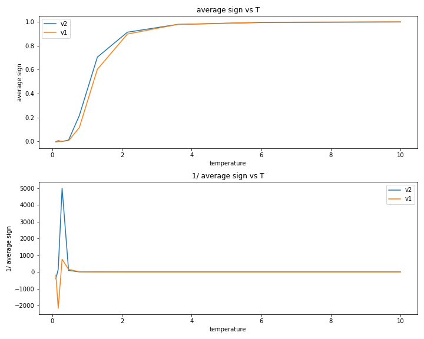

 
 
- J1 = 0.4, T = [0.1, ..., 10.0]

result of v1 model

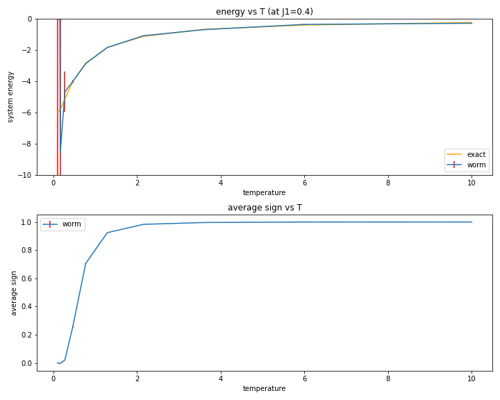

result of v2 model

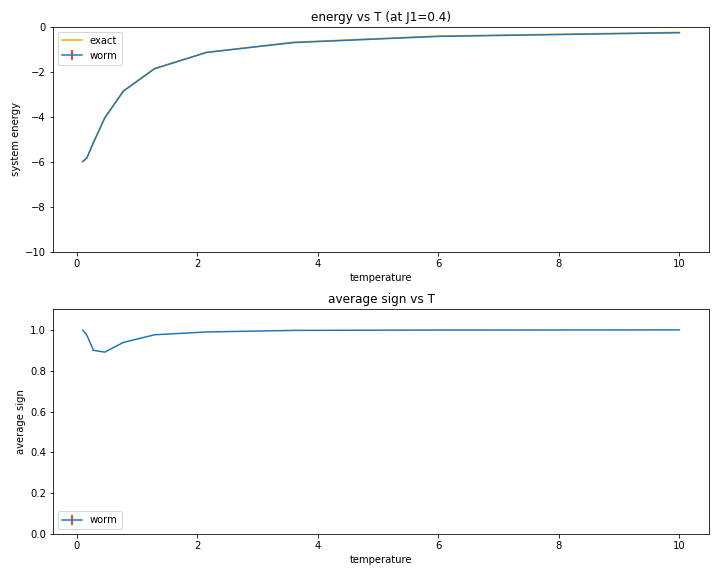

#### Without exact solution
- J1 = 0.77, T = [0.1, ..., 10.0]

energy comparison

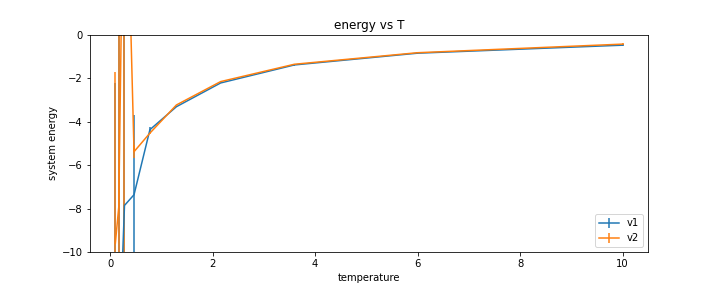

ave sign comparison

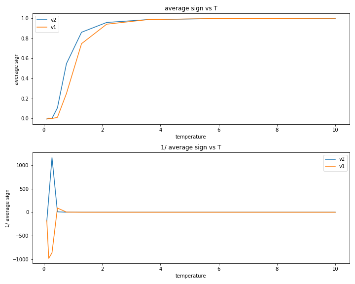

- J1 = 0.7, T = [0.1, ..., 10.0]

energy comparison

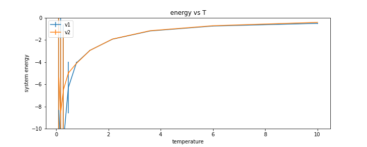

ave sign comparison

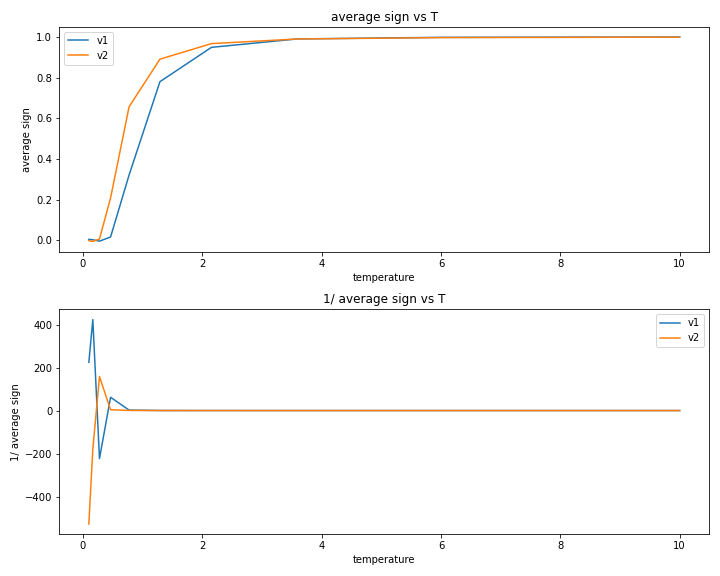

- J1 = 0.5, T = [0.1, ..., 10.0]

energy comparison

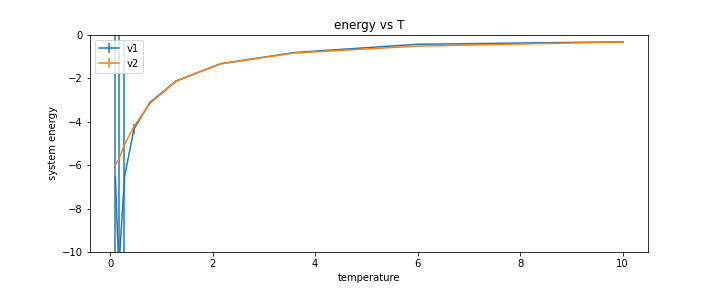

ave sign comparison

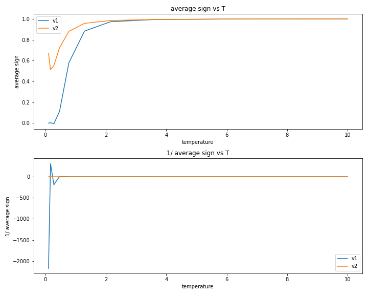

- J1 = 0.3, T = [0.1, ..., 10.0]

energy comparison

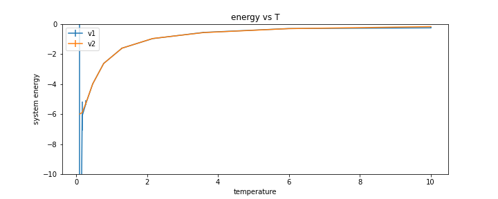

ave sign comparison

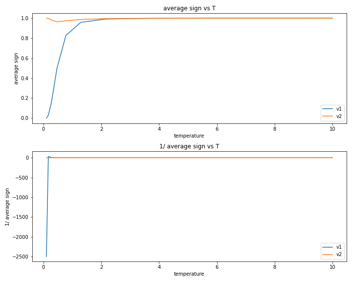

### At fixed T

- T = 1

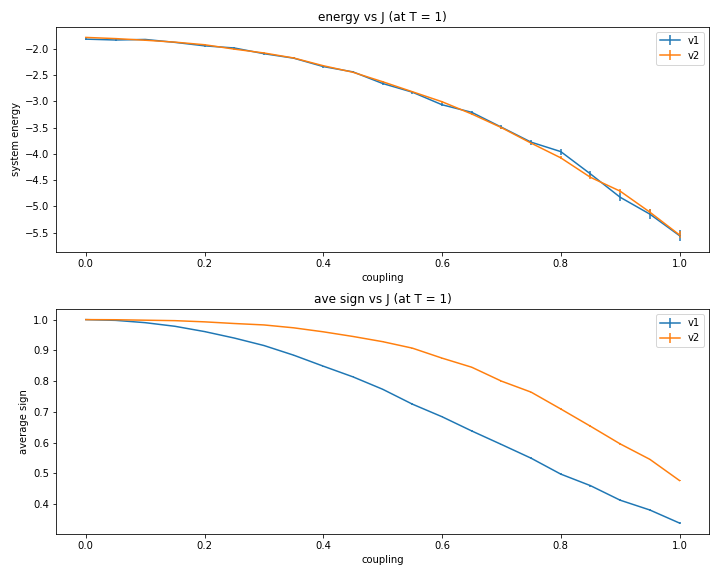

- T = 0.3

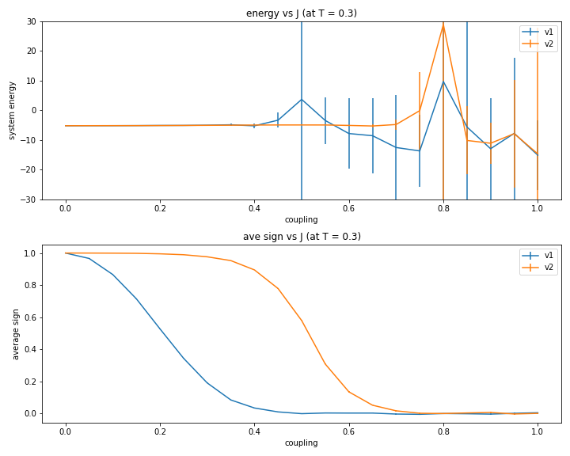

- T = 0.1

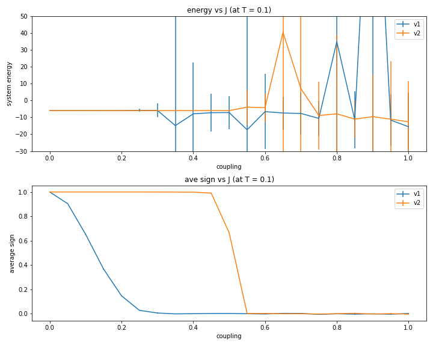

- look into the details with T = 0.1 , J = [0.4, ..., 0.6].

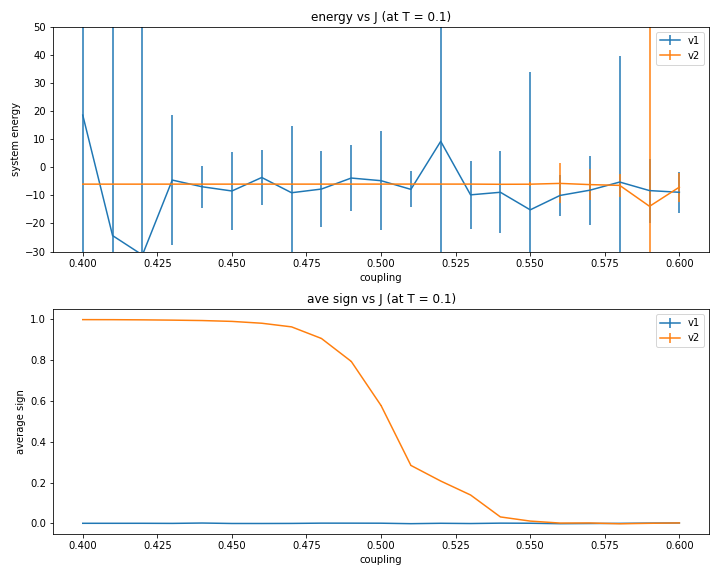

 dimer order-parameter 

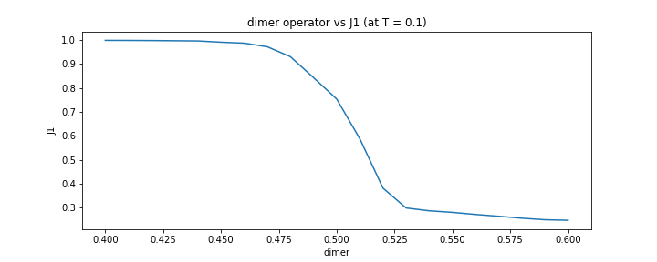

As you can see, average sign change dramatically around J1 = 0.475. and dimer operator and average sign looks almost same shape.

The reason why almost all configurations are dimer singlet for J1 < 0.475 can be understood from peterbation on J1 for absolute-value-version local hamiltonian (which means that in worm algorithm, we first solve the problem for absolute-value-version local hamiltonian, then calculate physical quantities of original model using average sign). When J1 = 0, no configurations have triplet at zero temperature. 

***The problem*** is how dimer order-parameter relates to average sign?

## Calculate in larger system size.

