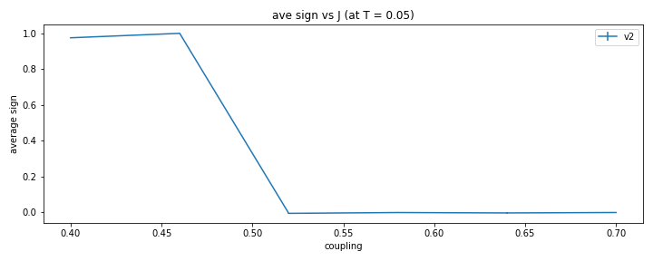

# Shastry-Sutherland 

### exact diagonalization for L = [2,2]
- spectrum is saved in `data/shastry_exact.npy`
- At T = 1, $\langle\hat{H}\rangle=-5.58551...$

### Phase diagram

- Dimer singlet ($J/JD = J_1/J_2< 0.68$) (it is know that ground state is exactly the state covered with dimer dingelt)
- Plaquette singlet ($0.68 < J_1/J_2 < 0.76$)
- AF Neel ($J_1/J_2 > 0.76$)

It is assumed that in singlet-triplet basis, almost all configuration is $[0,0,...,0]$

## results

Here, we set $J_2$ = 1
### At fixed J1 

#### Compare with exact diagonalization

- J1 = 1, T = [0.1, ..., 10.0]

result of v1 model

result of v2 model

Comparing average sign between v1 and v2

 
 
- J1 = 0.4, T = [0.1, ..., 10.0]

result of v1 model

result of v2 model

#### Without exact solution
- J1 = 0.77, T = [0.1, ..., 10.0]

energy comparison

ave sign comparison

- J1 = 0.7, T = [0.1, ..., 10.0]

energy comparison

ave sign comparison

- J1 = 0.5, T = [0.1, ..., 10.0]

energy comparison

ave sign comparison

- J1 = 0.3, T = [0.1, ..., 10.0]

energy comparison

ave sign comparison

### At fixed T

- T = 1

- T = 0.3

- T = 0.1

- look into the details with T = 0.1 , J = [0.4, ..., 0.6].

 dimer order-parameter 

As you can see, average sign change dramatically around J1 = 0.475. and dimer operator and average sign looks almost same shape.

The reason why almost all configurations are dimer singlet for J1 < 0.475 can be understood from peterbation on J1 for absolute-value-version local hamiltonian (which means that in worm algorithm, we first solve the problem for absolute-value-version local hamiltonian, then calculate physical quantities of original model using average sign). When J1 = 0, no configurations have triplet at zero temperature. 

***The problem*** is how dimer order-parameter relates to average sign?

### modified model to SS
Add $H[0,1] = H[1,0] = 0.5$ and $H[0,4] = H[4,0] = 0.5$. Local hams are listed under `/data` folder
Theoritically, average sign goes down from 1 as $T \rightarrow 0$ for small $J_1$ 

 J1 = 1 T = [0.1, ..., 1] 

 
 

 J1 = 0.4 T = [0.1, ..., 1] 

 
 

 J1 = 0.1 T = [0.1, ..., 1] 

#### more detail
## Calculate in larger system size.

 J1 = 0.1 T = [0.001, ..., 1] 

## Larger system size

 T = 0.1 J1 = [0, 0.1, .., 1] 

## energy spectrums
  
  - ## 0.2 < J < 0.3
  - ### L = 4
    
  - ### L = 8
    
  - 0.21

        energy spectrum of H1 : 
        [-0.375      -0.21774603 -0.21774603 -0.21774603 -0.125      -0.125      -0.125      -0.085       0.11274603  0.11274603  0.11274603  0.23        0.23        0.23        0.23        0.23      ]
        energy spectrum of stochastic H1 : 
        [-4.95956293e-02 -6.61762045e-02 -6.61762045e-02  1.38777878e-16  2.08166817e-16  1.05000000e-01  1.05000000e-01  1.54595629e-01  2.91433544e-16  1.22539713e-02  1.22539713e-02 -1.05000000e-01 -5.10777668e-02 -5.10777668e-02 -5.55111512e-17 -1.94289029e-16]
        energy spectrum of stochastic H1_singlet : 
        [ 1.11022302e-16 -1.95231955e-02 -5.55111512e-17  2.77555756e-17  1.80411242e-16  5.55111512e-17  6.93889390e-17  9.02255599e-02 -9.27460287e-02 -6.93889390e-17 -6.93889390e-17 -1.94289029e-16 -8.32667268e-17  0.00000000e+00 -2.77555756e-17  2.20436644e-02]
        energy spectrum of stochastic H1_optim : 
        [ 2.73270295e-12 -1.92599615e-02  8.99833704e-04  1.78512316e-02  4.07215928e-13  5.44203571e-13  8.83779161e-13  1.97264877e-03 -1.76099744e-02  1.08994569e-03  1.90386176e-02 -2.90824753e-03 -1.07035267e-03 -3.74132641e-06 -2.79415380e-13  2.55686583e-11]

        energy spectrum of H2 : 
        [-0.375      -0.21774603 -0.21774603 -0.21774603 -0.125      -0.125      -0.125      -0.085       0.11274603  0.11274603  0.11274603  0.23        0.23        0.23        0.23        0.23      ]
        energy spectrum of stochastic H2 : 
        [-4.95956293e-02 -6.61762045e-02 -6.61762045e-02 -1.11022302e-16  5.55111512e-17  1.05000000e-01  1.05000000e-01  1.54595629e-01 -6.93889390e-17  1.22539713e-02  1.22539713e-02 -1.05000000e-01 -5.10777668e-02 -5.10777668e-02  0.00000000e+00  0.00000000e+00]
        energy spectrum of stochastic H2_singlet : 
        [ 2.22044605e-16 -1.95231955e-02 -1.11022302e-16 -2.77555756e-17  4.16333634e-17  0.00000000e+00 -9.71445147e-17  9.02255599e-02 -9.27460287e-02 -1.94289029e-16 -2.77555756e-17 -5.55111512e-17  2.77555756e-17  1.11022302e-16  2.77555756e-17  2.20436644e-02]
        energy spectrum of stochastic H2_optim : 
        [ 2.73320255e-12 -1.92599624e-02  8.99836713e-04  1.78512295e-02  4.06938372e-13  5.44092549e-13  8.83584872e-13  1.97264882e-03 -1.76099759e-02  1.08994847e-03  1.90386164e-02 -2.90824753e-03 -1.07035267e-03 -3.74132641e-06 -2.79359869e-13  2.55684363e-11]

  - 0.24

        energy spectrum of H1 : 
        [-0.375      -0.24172782 -0.24172782 -0.24172782 -0.125      -0.125      -0.125      -0.115       0.12172782  0.12172782  0.12172782  0.245       0.245       0.245       0.245       0.245     ]
        energy spectrum of stochastic H1 : 
        [-6.47547841e-02 -6.93199858e-02 -6.93199858e-02  8.32667268e-17  0.00000000e+00  1.20000000e-01  1.20000000e-01  1.84754784e-01 -2.77555756e-17  3.27218155e-03  3.27218155e-03 -1.20000000e-01 -5.39521958e-02 -5.39521958e-02  0.00000000e+00  0.00000000e+00]
        energy spectrum of stochastic H1_singlet : 
        [-1.11022302e-16 -2.69216909e-02 -2.49800181e-16  0.00000000e+00 -2.77555756e-17  0.00000000e+00  6.93889390e-17  1.16066856e-01 -1.16727818e-01 -2.08166817e-16 -9.71445147e-17  5.55111512e-17  1.38777878e-16  5.55111512e-17  3.05311332e-16  2.75826534e-02]
        energy spectrum of stochastic H1_optim : 
        [ 9.78106485e-13 -4.53457781e-02 -8.74328751e-03  3.02152892e-02  1.93817185e-13  2.91502933e-13  3.32109340e-13  1.12189485e-01 -1.08766069e-01 -2.96617510e-02  2.53323803e-02 -6.37957932e-04 -4.46987661e-04  2.16493490e-15  7.32533478e-12  2.58646765e-02]

        energy spectrum of H2 : 
        [-0.375      -0.24172782 -0.24172782 -0.24172782 -0.125      -0.125      -0.125      -0.115       0.12172782  0.12172782  0.12172782  0.245       0.245       0.245       0.245       0.245     ]
        energy spectrum of stochastic H2 : 
        [-6.47547841e-02 -6.93199858e-02 -6.93199858e-02 -2.49800181e-16  2.22044605e-16  1.20000000e-01  1.20000000e-01  1.84754784e-01  3.74700271e-16  3.27218155e-03  3.27218155e-03 -1.20000000e-01 -5.39521958e-02 -5.39521958e-02  0.00000000e+00  0.00000000e+00]
        energy spectrum of stochastic H2_singlet : 
        [ 2.22044605e-16 -2.69216909e-02 -2.22044605e-16  2.77555756e-17 -2.77555756e-17 -1.24900090e-16 -2.77555756e-17  1.16066856e-01 -1.16727818e-01 -8.32667268e-17 -9.71445147e-17 -1.11022302e-16  2.77555756e-17  2.77555756e-17  3.05311332e-16  2.75826534e-02]
        energy spectrum of stochastic H2_optim : 
        [ 9.78550574e-13 -4.53457712e-02 -8.74328920e-03  3.02152833e-02  1.93858818e-13  2.91433544e-13  3.32067707e-13  1.12189488e-01 -1.08766069e-01 -2.96617553e-02  2.53323788e-02 -6.37957932e-04 -4.46987661e-04  1.99840144e-15  7.32552907e-12  2.58646800e-02]

  - ## 0.3 < J < 0.4
  - ### L = 4
    
  - ### L = 8
    

  - 0.32

        Namespace(coupling=0.32)
        [-0.375      -0.31070544 -0.31070544 -0.31070544 -0.195      -0.125      -0.125      -0.125       0.15070544  0.15070544  0.15070544  0.285       0.285       0.285       0.285       0.285     ]
        energy spectrum of stochastic H1 : 
        [-1.13019434e-01 -7.46222529e-02 -7.46222529e-02 -5.55111512e-17  7.00000000e-02  1.60000000e-01  1.60000000e-01  2.03019434e-01 -2.57054399e-02 -2.57054399e-02 -2.57054399e-02 -1.34294560e-01 -5.96723072e-02 -5.96723072e-02  0.00000000e+00 -1.11022302e-16]
        energy spectrum of stochastic H1_singlet : 
        [ 1.11022302e-16 -4.85679948e-02 -2.77555756e-16 -5.55111512e-17  7.00000000e-02  0.00000000e+00  1.80411242e-16  9.00000000e-02 -1.55333480e-01 -2.77555756e-17 -5.55111512e-17  5.55111512e-17  1.11022302e-16  5.55111512e-17  1.11022302e-16  4.39014751e-02]
        energy spectrum of stochastic H1_optim : 
        [ 9.25981514e-13 -5.50378965e-02 -4.44917766e-02  5.86890059e-02  7.00000000e-02  2.95791169e-13  3.16080495e-13  1.08078761e-01 -1.65178041e-01 -5.86710361e-02  4.65061796e-02 -2.15394414e-05 -1.32694877e-05  8.42437231e-13  1.61836655e-11  4.01396128e-02]

        energy spectrum of H2 : 
        [-0.375      -0.31070544 -0.31070544 -0.31070544 -0.195      -0.125      -0.125      -0.125       0.15070544  0.15070544  0.15070544  0.285       0.285       0.285       0.285       0.285     ]
        energy spectrum of stochastic H2 : 
        [-1.13019434e-01 -7.46222529e-02 -7.46222529e-02 -4.44089210e-16  7.00000000e-02  1.60000000e-01  1.60000000e-01  2.03019434e-01 -2.57054399e-02 -2.57054399e-02 -2.57054399e-02 -1.34294560e-01 -5.96723072e-02 -5.96723072e-02  0.00000000e+00 -5.55111512e-17]
        energy spectrum of stochastic H2_singlet : 
        [ 5.55111512e-17 -4.85679948e-02 -1.11022302e-16 -1.11022302e-16  7.00000000e-02 -5.55111512e-17  1.80411242e-16  9.00000000e-02 -1.55333480e-01  0.00000000e+00  2.77555756e-17  2.22044605e-16  5.55111512e-17  5.55111512e-17  1.11022302e-16  4.39014751e-02]
        energy spectrum of stochastic H2_optim : 
        [ 9.26259069e-13 -5.50378959e-02 -4.44917772e-02  5.86890058e-02  7.00000000e-02  2.95638514e-13  3.16191517e-13  1.08078761e-01 -1.65178041e-01 -5.86710363e-02  4.65061795e-02 -2.15394414e-05 -1.32694877e-05  8.42548253e-13  1.61836100e-11  4.01396129e-02]

  - J = 1/3 にて、$stoquastic(\hat{h})$の最小固有値(固有状態はsinglet)が$\hat{h}$の最小固有値より小さくなる。グローバルな固有状態はsingletが敷き詰められたものなので、絶対零度では負符号は無いが、有限温度になるとlocal hamiltonianの基底状態の影響が現れるため、最適化手法のほうが良い値が出ている。

  - 0.34

        [0.34, 1]
        energy spectrum of H1 : 
         [-0.375      -0.32872115 -0.32872115 -0.32872115 -0.215      -0.125      -0.125      -0.125       0.15872115  0.15872115  0.15872115  0.295       0.295       0.295       0.295       0.295     ]
        energy spectrum of stochastic H1 : 
         [-0.50159047 -0.40421779 -0.40421779 -0.32872115 -0.125       0.045       0.045       0.08159047  0.125       0.125       0.125       0.15872115  0.23421779  0.23421779  0.295       0.295     ]
        energy spectrum of stochastic H1_singlet : 
         [-0.38290946 -0.375      -0.32872115 -0.32872115 -0.125      -0.125      -0.125      -0.045      -0.00534952  0.15872115  0.15872115  0.295       0.295       0.295       0.295       0.34325898]
        energy spectrum of stochastic H1_optim : 
         [-0.375      -0.35946951 -0.3380527  -0.29480859 -0.20327508 -0.125      -0.125      -0.125       0.12459736  0.16331016  0.18895942  0.2888493   0.29489013  0.2949995   0.295       0.295     ]

        energy spectrum of H2 : 
         [-0.375      -0.32872115 -0.32872115 -0.32872115 -0.215      -0.125      -0.125      -0.125       0.15872115  0.15872115  0.15872115  0.295       0.295       0.295       0.295       0.295     ]
        energy spectrum of stochastic H2 : 
         [-0.50159047 -0.40421779 -0.40421779 -0.32872115 -0.125       0.045       0.045       0.08159047  0.125       0.125       0.125       0.15872115  0.23421779  0.23421779  0.295       0.295     ]
        energy spectrum of stochastic H2_singlet : 
         [-0.38290946 -0.375      -0.32872115 -0.32872115 -0.125      -0.125      -0.125      -0.045      -0.00534952  0.15872115  0.15872115  0.295       0.295       0.295       0.295       0.34325898]
        energy spectrum of stochastic H2_optim : 
         [-0.375      -0.35946951 -0.3380527  -0.29480859 -0.20327508 -0.125      -0.125      -0.125       0.12459736  0.16331016  0.18895942  0.2888493   0.29489013  0.2949995   0.295       0.295     ]

  - 0.39

        Namespace(coupling=0.39)
        [0.39, 1]
        energy spectrum of H1 : 
        [-0.375      -0.37463941 -0.37463941 -0.37463941 -0.265      -0.125      -0.125      -0.125       0.17963941  0.17963941  0.17963941  0.32        0.32        0.32        0.32        0.32      ]
        energy spectrum of stochastic H1 : 
        [-0.53762894 -0.45183917 -0.45183917 -0.37463941 -0.125       0.07        0.07        0.09262894  0.125       0.125       0.125       0.17963941  0.25683917  0.25683917  0.32        0.32      ]
        energy spectrum of stochastic H1_singlet : 
        [-0.44302102 -0.375      -0.37463941 -0.37463941 -0.125      -0.125      -0.125      -0.07       -0.00650507  0.17963941  0.17963941  0.32        0.32        0.32        0.32        0.3795261 ]
        energy spectrum of stochastic H1_optim : 
        [-0.375      -0.3747671  -0.37463937 -0.37451189 -0.26499977 -0.125      -0.125      -0.125       0.17951181  0.1796394   0.179767    0.31999995  0.31999997  0.32        0.32        0.32      ]

        energy spectrum of H2 : 
        [-0.375      -0.37463941 -0.37463941 -0.37463941 -0.265      -0.125      -0.125      -0.125       0.17963941  0.17963941  0.17963941  0.32        0.32        0.32        0.32        0.32      ]
        energy spectrum of stochastic H2 : 
        [-0.53762894 -0.45183917 -0.45183917 -0.37463941 -0.125       0.07        0.07        0.09262894  0.125       0.125       0.125       0.17963941  0.25683917  0.25683917  0.32        0.32      ]
        energy spectrum of stochastic H2_singlet : 
        [-0.44302102 -0.375      -0.37463941 -0.37463941 -0.125      -0.125      -0.125      -0.07       -0.00650507  0.17963941  0.17963941  0.32        0.32        0.32        0.32        0.3795261 ]
        energy spectrum of stochastic H2_optim : 
        [-0.375      -0.3747671  -0.37463937 -0.37451189 -0.26499977 -0.125      -0.125      -0.125       0.17951181  0.1796394   0.179767    0.31999995  0.31999997  0.32        0.32        0.32      ]

  - 0.39付近で基底状態の遷移あり
  
    J/4 - 2199023255552*((9*J^2)/77371252455336267181195264 - J/77371252455336267181195264 + 1/309485009821345068724781056)^(1/2)

    
  - ## 0.4 < J < 0.5
  - ### L = 4
    
  - ### L = 8
    

  - 0.49

        [0.49, 1]
        energy spectrum of H1 : 
        [-0.46899134 -0.46899134 -0.46899134 -0.375      -0.365      -0.125      -0.125      -0.125       0.22399134  0.22399134  0.22399134  0.37        0.37        0.37        0.37        0.37      ]
        energy spectrum of stochastic H1 : 
        [-0.61669676 -0.54830072 -0.54830072 -0.46899134 -0.125       0.12        0.12        0.12169676  0.125       0.125       0.125       0.22399134  0.30330072  0.30330072  0.37        0.37      ]
        energy spectrum of stochastic H1_singlet : 
        [-0.56597642 -0.46899134 -0.46899134 -0.375      -0.125      -0.125      -0.125      -0.12       -0.00730856  0.22399134  0.22399134  0.37        0.37        0.37        0.37        0.45328498]
        energy spectrum of stochastic H1_optim : 
        [-0.46899134 -0.46899134 -0.46899134 -0.375      -0.365      -0.125      -0.125      -0.125       0.22399134  0.22399134  0.22399134  0.37        0.37        0.37        0.37        0.37      ]

        energy spectrum of H2 : 
        [-0.46899134 -0.46899134 -0.46899134 -0.375      -0.365      -0.125      -0.125      -0.125       0.22399134  0.22399134  0.22399134  0.37        0.37        0.37        0.37        0.37      ]
        energy spectrum of stochastic H2 : 
        [-0.61669676 -0.54830072 -0.54830072 -0.46899134 -0.125       0.12        0.12        0.12169676  0.125       0.125       0.125       0.22399134  0.30330072  0.30330072  0.37        0.37      ]
        energy spectrum of stochastic H2_singlet : 
        [-0.56597642 -0.46899134 -0.46899134 -0.375      -0.125      -0.125      -0.125      -0.12       -0.00730856  0.22399134  0.22399134  0.37        0.37        0.37        0.37        0.45328498]
        energy spectrum of stochastic H2_optim : 
        [-0.46899134 -0.46899134 -0.46899134 -0.375      -0.365      -0.125      -0.125      -0.125       0.22399134  0.22399134  0.22399134  0.37        0.37        0.37        0.37        0.37      ]

  - ## 0.5 < J < 0.6
  - ### L = 4
    
  - ### L = 8
    

 - J=0.55

        Namespace(coupling=0.55)
        [0.55, 1]
        energy spectrum of H1 : 
        [-0.52660956 -0.52660956 -0.52660956 -0.425      -0.375      -0.125      -0.125      -0.125       0.25160956  0.25160956  0.25160956  0.4         0.4         0.4         0.4         0.4       ]
        energy spectrum of stochastic H1 : 
        [-0.66735337 -0.60670811 -0.60670811 -0.52660956 -0.125       0.125       0.125       0.125       0.14235337  0.15        0.15        0.25160956  0.33170811  0.33170811  0.4         0.4       ]
        energy spectrum of stochastic H1_singlet : 
        [-0.64076698 -0.52660956 -0.52660956 -0.375      -0.15       -0.125      -0.125      -0.125      -0.00734321  0.25160956  0.25160956  0.4         0.4         0.4         0.4         0.49811019]
        energy spectrum of stochastic H1_optim : 
        [-0.52660956 -0.52660956 -0.52660956 -0.425      -0.375      -0.125      -0.125      -0.125       0.25160956  0.25160956  0.25160956  0.4         0.4         0.4         0.4         0.4       ]

        energy spectrum of H2 : 
        [-0.52660956 -0.52660956 -0.52660956 -0.425      -0.375      -0.125      -0.125      -0.125       0.25160956  0.25160956  0.25160956  0.4         0.4         0.4         0.4         0.4       ]
        energy spectrum of stochastic H2 : 
        [-0.66735337 -0.60670811 -0.60670811 -0.52660956 -0.125       0.125       0.125       0.125       0.14235337  0.15        0.15        0.25160956  0.33170811  0.33170811  0.4         0.4       ]
        energy spectrum of stochastic H2_singlet : 
        [-0.64076698 -0.52660956 -0.52660956 -0.375      -0.15       -0.125      -0.125      -0.125      -0.00734321  0.25160956  0.25160956  0.4         0.4         0.4         0.4         0.49811019]
        energy spectrum of stochastic H2_optim : 
        [-0.52660956 -0.52660956 -0.52660956 -0.425      -0.375      -0.125      -0.125      -0.125       0.25160956  0.25160956  0.25160956  0.4         0.4         0.4         0.4         0.4       ]

  - # average sign behave inconsistently at low temperature 
  
  

  - average sign for singlet seems fine.
  - Above image is for N = 100,000 if simulate with N = 10,000,000, then the result is 

        J                    = 0.48
        T                    = 0.07
        Total Energy         = -17.7178 +- 0.00252413
        Elapsed time         = 583.1 sec
        Speed                = 17235.5 MCS/sec
        Energy per site      = -0.553682 +- 7.88791e-05
        average sign         = 0.954002 +- 9.48048e-05
        dimer operator       = 0.0119363
        # of operators       = 565.744
        # of neg sign op     = 7.21165
        breakout rate        = 0

  and 
  
        J                    = 0.478
        T                    = 0.07
        Total Energy         = -17.6917 +- 0.00251726
        Elapsed time         = 573.553 sec
        Speed                = 17522.4 MCS/sec
        Energy per site      = -0.552867 +- 7.86644e-05
        average sign         = 0.954143 +- 9.46628e-05
        dimer operator       = 0.0119521
        # of operators       = 565.273
        # of neg sign op     = 7.23234
        breakout rate        = 0

  Hamiltonian at $J=0.48$ is : 

  Optimized H1

      [[ 0.375 -0.     0.    -0.    -0.     0.    -0.     0.     0.     0.    -0.    -0.    -0.    -0.     0.     0.   ]
      [-0.     0.125  0.    -0.    -0.     0.    -0.    -0.     0.     0.    -0.     0.24   0.    -0.    -0.24   0.   ]
      [ 0.     0.     0.125  0.    -0.    -0.     0.    -0.24   0.    -0.     0.    -0.    -0.     0.24  -0.     0.   ]
      [-0.    -0.     0.     0.125  0.    -0.    -0.24   0.    -0.     0.24  -0.     0.     0.    -0.    -0.    -0.   ]
      [-0.    -0.    -0.     0.     0.125  0.     0.    -0.     0.     0.    -0.    -0.     0.    -0.     0.     0.   ]
      [ 0.     0.    -0.    -0.     0.    -0.125 -0.    -0.    -0.    -0.     0.24   0.    -0.    -0.    -0.    -0.24 ]
      [-0.    -0.     0.    -0.24   0.    -0.    -0.125  0.     0.    -0.24  -0.    -0.    -0.     0.    -0.    -0.   ]
      [ 0.    -0.    -0.24   0.    -0.    -0.     0.    -0.125 -0.     0.     0.    -0.     0.    -0.24  -0.    -0.   ]
      [ 0.     0.     0.    -0.     0.    -0.     0.    -0.     0.125  0.     0.    -0.    -0.    -0.    -0.     0.   ]
      [ 0.     0.    -0.     0.24   0.    -0.    -0.24   0.     0.    -0.125 -0.    -0.    -0.     0.    -0.    -0.   ]
      [-0.    -0.     0.    -0.    -0.     0.24  -0.     0.     0.    -0.    -0.125  0.    -0.     0.     0.    -0.24 ]
      [-0.     0.24  -0.     0.    -0.     0.    -0.    -0.    -0.    -0.     0.    -0.125  0.    -0.    -0.24   0.   ]
      [-0.     0.    -0.     0.     0.    -0.    -0.     0.    -0.    -0.    -0.     0.     0.125  0.     0.    -0.   ]
      [-0.    -0.     0.24  -0.    -0.    -0.     0.    -0.24  -0.     0.     0.    -0.     0.    -0.125 -0.    -0.   ]
      [ 0.    -0.24  -0.    -0.     0.    -0.    -0.    -0.    -0.    -0.     0.    -0.24   0.    -0.    -0.125  0.   ]
      [ 0.     0.     0.    -0.     0.    -0.24  -0.    -0.     0.    -0.    -0.24   0.    -0.    -0.     0.    -0.125]]

  Singlet H1

      [[ 0.375  0.     0.     0.     0.     0.     0.     0.     0.     0.     0.     0.     0.     0.     0.     0.   ]
      [ 0.     0.125  0.     0.    -0.     0.    -0.24   0.     0.     0.24   0.     0.     0.     0.     0.     0.   ]
      [-0.     0.     0.125  0.     0.     0.     0.    -0.24   0.     0.    -0.     0.     0.     0.24   0.     0.   ]
      [ 0.     0.     0.     0.125  0.     0.     0.     0.     0.     0.     0.    -0.24   0.     0.     0.24   0.   ]
      [ 0.    -0.     0.     0.     0.125  0.    -0.     0.     0.    -0.     0.     0.     0.     0.     0.     0.   ]
      [ 0.     0.     0.     0.     0.    -0.365  0.     0.     0.     0.     0.     0.     0.     0.     0.     0.   ]
      [ 0.    -0.24   0.     0.     0.     0.    -0.125  0.     0.    -0.24   0.     0.     0.     0.     0.     0.   ]
      [ 0.     0.    -0.24   0.     0.     0.     0.     0.115  0.     0.    -0.24   0.     0.     0.     0.     0.   ]
      [-0.     0.     0.     0.     0.     0.     0.     0.     0.125  0.    -0.     0.     0.     0.     0.     0.   ]
      [ 0.     0.24   0.     0.    -0.     0.    -0.24   0.     0.    -0.125  0.     0.     0.     0.     0.     0.   ]
      [-0.     0.     0.     0.     0.     0.     0.    -0.24   0.     0.    -0.125  0.     0.    -0.24   0.     0.   ]
      [ 0.     0.     0.    -0.24   0.     0.     0.     0.     0.     0.     0.    -0.125  0.     0.    -0.24   0.   ]
      [ 0.     0.     0.     0.     0.     0.     0.     0.     0.     0.     0.    -0.     0.125  0.     0.     0.   ]
      [-0.     0.     0.24   0.     0.     0.     0.     0.     0.     0.    -0.24   0.     0.     0.115  0.     0.   ]
      [ 0.     0.     0.     0.24   0.     0.     0.     0.     0.     0.     0.    -0.24   0.     0.    -0.125  0.   ]
      [ 0.     0.     0.     0.     0.     0.     0.     0.     0.     0.     0.     0.     0.     0.     0.    -0.365]]

  looks similar. Indeed, both return 0 for $\langle s, d | H1 | d^\prime, s \rangle $ and $\langle s, s | H1 | d, \psi \rangle$ therefore, to have all states flip to singlet, warm needs to flipa  whole vertical line to singlet. (It needs to overcome the very low probability)